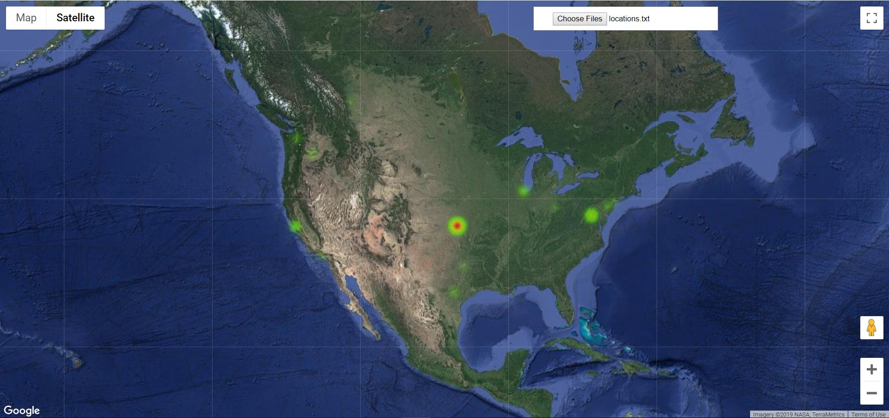

# crawlmap
Geographical and network map of the Web #HackIllinois2019

Crawls websites for URLs and plots an interactive geographical heat map of server locations and a network map of connectivity.

Interactive geographical heatmap uses Google Maps API for plotting and IPStack API for geolocation.

Networkmap uses MatPlotLib and NetworkX for plotting.
